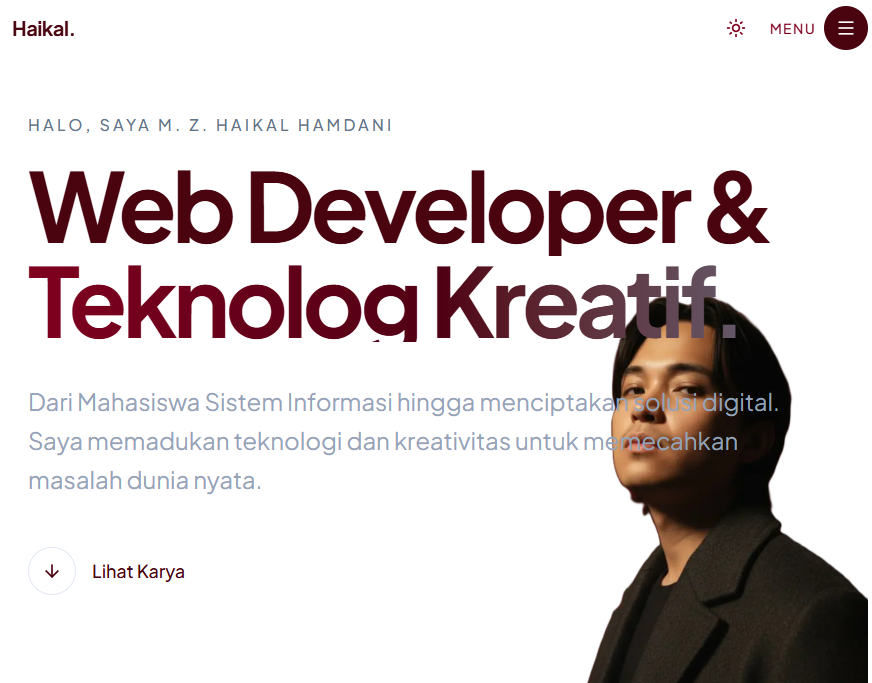

# Portfolio M. Z. Haikal Hamdani

Website portofolio pribadi yang dirancang dengan filosofi **"Smart Compact"**, modern, dan profesional. Dibangun menggunakan teknologi web modern untuk performa tinggi, aksesibilitas, dan pengalaman pengguna yang seamless.



## 🌟 Fitur Utama

- **Smart Compact Design**: Informasi padat dan efisien tanpa mengurangi estetika.
- **Dual Language**: Mendukung Bahasa Indonesia dan Bahasa Inggris (ID/EN) dengan transisi instan.
- **Native Scroll Experience**: Menggunakan native CSS Scroll Snap untuk carousel proyek yang smooth dan performan tinggi.
- **Responsive & Mobile First**: Tampilan optimal di semua perangkat, dari smartphone hingga desktop layar lebar.
- **Twin Portrait Hero**: Hero section unik dengan dual-image layout (desktop) yang menyesuaikan diri di mobile.
- **Dynamic Content**: Semua konten teks dikelola melalui sistem kamus (dictionary) terpusat untuk kemudahan maintenance dan lokalisasi.

## 🛠️ Teknologi

Project ini dibangun di atas stack teknologi modern:

- **Framework**: [Next.js 16](https://nextjs.org/) (App Router)
- **Language**: [TypeScript](https://www.typescriptlang.org/)
- **Styling**: [Tailwind CSS v4](https://tailwindcss.com/)
- **Animation**: [Framer Motion](https://www.framer.com/motion/) (untuk entry animations)
- **Icons**: [Lucide React](https://lucide.dev/)
- **State Management**: React Context (untuk Theme & Language)

## 🚀 Cara Menjalankan

Ikuti langkah-langkah ini untuk menjalankan proyek di komputer lokal Anda:

1.  **Clone Repository**
    ```bash
    git clone https://github.com/ZephyrGraphic/portfolio.git
    cd portfolio
    ```

2.  **Install Dependencies**
    ```bash
    npm install
    ```

3.  **Jalankan Development Server**
    ```bash
    npm run dev
    ```

4.  **Buka Browser**
    Akses `http://localhost:3000` untuk melihat hasilnya.

## 📁 Struktur Proyek

- `/src/app`: Halaman utama dan layout global.
- `/src/components`: Komponen UI reusable (Hero, Projects, Experience, dll).
- `/src/lib`: Utilitas dan data dictionary (konten teks).
- `/public`: Aset statis (gambar, icon).

## 🎨 Design Philosophy

Layout didesain untuk merefleksikan identitas sebagai **"Web Developer & Teknolog Kreatif"**.
- **Warna**: Maroon & Grey (Elegan, Profesional, Berani).
- **Tipografi**: Plus Jakarta Sans (Modern, Geometris, Mudah dibaca).
- **Interaksi**: Fokus pada *micro-interactions* yang halus (hover effects, smooth transitions) tanpa mengorbankan performa.

---
© 2024 Haikal. Dibuat dengan ♥ dan Ayam Geprek.
